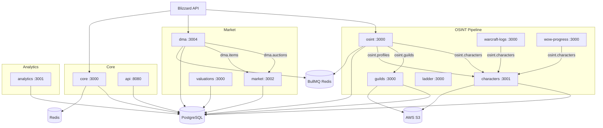

<p align="center">
  
</p>

<h1 align="center">CMNW — Community Network</h1>

<p align="center"><em>Intelligence always wins</em></p>

<p align="center">
  
  
  
  
  
</p>

---

## Architecture


```mermaid
flowchart TB
  subgraph Core
    core[core :3000]
    api[api :8080]
  end

  subgraph OSINT["OSINT Pipeline"]
    osint[osint :3000]
    characters[characters :3001]
    guilds[guilds :3000]
    wl[warcraft-logs :3000]
    wp[wow-progress :3000]
    ladder[ladder :3000]
  end

  subgraph Market
    dma[dma :3004]
    market[market :3002]
    valuations[valuations :3000]
  end

  subgraph Analytics
    analytics[analytics :3001]
  end

  blizzard[Blizzard API] --> osint
  blizzard --> dma
  blizzard --> core

  osint -->|osint.characters| characters
  osint -->|osint.guilds| guilds
  osint -->|osint.profiles| characters
  wp -->|osint.characters| characters
  wl -->|osint.characters| characters
  dma -->|dma.auctions| market
  dma -->|dma.items| market

  core --> pg[(PostgreSQL)]
  api --> pg
  osint --> pg
  characters --> pg
  guilds --> pg
  dma --> pg
  market --> pg
  valuations --> pg
  analytics --> pg

  core --> redis[(Redis)]
  osint --> bullmq[(BullMQ Redis)]
  dma --> bullmq
  characters --> s3[(AWS S3)]
  guilds --> s3
```

---

## Microservices

| Service           | Port | Purpose                      |
| ----------------- | ---- | ---------------------------- |
| **core**          | 3000 | Realms, keys, authentication |
| **api**           | 8080 | REST gateway + Swagger UI    |
| **osint**         | 3000 | Character/guild intelligence |
| **characters**    | 3001 | Player profile processing    |
| **guilds**        | 3000 | Guild analytics processing   |
| **dma**           | 3004 | Auction house monitoring     |
| **market**        | 3002 | XVA calculations & pricing   |
| **valuations**    | 3000 | Financial modeling           |
| **analytics**     | 3001 | Metrics aggregation          |
| **ladder**        | 3000 | Leaderboard rankings         |
| **warcraft-logs** | 3000 | Raid log intelligence        |
| **wow-progress**  | 3000 | Progress tracking & scraping |
| **tests**         | 3010 | E2E tests                    |

> Multiple services share port 3000 — they run in isolated containers and do not conflict in production.

---

## Shared Libraries

| Library           | Import Alias         | Purpose                        |
| ----------------- | -------------------- | ------------------------------ |
| **resources**     | `@app/resources`     | DTOs, queues, constants, utils |
| **pg**            | `@app/pg`            | TypeORM entities & enums       |
| **configuration** | `@app/configuration` | Environment config modules     |
| **logger**        | `@app/logger`        | Structured logging (Loki)      |
| **s3**            | `@app/s3`            | AWS S3 storage operations      |
| **battle-net**    | `@app/battle-net`    | Blizzard API client            |

---

## Tech Stack

| Layer         | Technology                  |
| ------------- | --------------------------- |
| Framework     | NestJS 11.x                 |
| Language      | TypeScript 5.9.3            |
| ORM           | TypeORM 0.3.x               |
| Message Queue | BullMQ 5.x (Redis-backed)   |
| Database      | PostgreSQL 17.4             |
| Cache / Queue | Redis 7.4.3 (2 instances)   |
| Storage       | AWS S3                      |
| Monitoring    | Grafana + Prometheus + Loki |
| Runtime       | Node.js >=24, pnpm >=10     |

---

## Prerequisites

- **Node.js** >=24.0.0
- **pnpm** >=10.0.0
- **Docker** & Docker Compose

---

## Quick Start

```bash
git clone https://github.com/alexzedim/cmnw.git
cd cmnw
pnpm install
cp .env.docker .env        # edit with your values
docker compose -f docker-compose.db.yml up -d
pnpm build:all
nest start core --watch
```

---

## Development Commands

| Script         | Command                       |
| -------------- | ----------------------------- |
| `build:all`    | Build all 12 services         |
| `build`        | `nest build` (single service) |
| `dev`          | Clean dist + watch mode       |
| `debug`        | Debug mode + watch            |
| `lint`         | ESLint with auto-fix          |
| `format`       | ESLint + Prettier             |
| `test`         | Jest with `--forceExit`       |
| `test:watch`   | Jest watch mode               |
| `test:cov`     | Jest with coverage            |
| `docker:build` | Build local Docker image      |
| `prod`         | Run production build          |
| `version`      | Print current version         |

---

## Project Structure

```
cmnw/
├── apps/
│   ├── core/               # Realms, keys, auth
│   ├── api/                # REST gateway + Swagger
│   ├── osint/              # Character/guild intelligence
│   ├── characters/         # Player profiles
│   ├── guilds/             # Guild analytics
│   ├── dma/                # Auction house monitoring
│   ├── market/             # XVA calculations
│   ├── valuations/         # Financial modeling
│   ├── analytics/          # Metrics aggregation
│   ├── ladder/             # Leaderboards
│   ├── warcraft-logs/      # Raid analytics
│   ├── wow-progress/       # Progress tracking
│   └── tests/              # E2E tests
├── libs/
│   ├── resources/          # DTOs, queues, constants, utils
│   ├── pg/                 # TypeORM entities & enums
│   ├── configuration/     # Environment config
│   ├── logger/             # Structured logging
│   ├── s3/                 # AWS S3 integration
│   └── battle-net/         # Blizzard API client
├── docker/                 # Dockerfiles
├── docs/                   # Documentation
├── .github/workflows/      # CI/CD pipelines
├── nest-cli.json           # NestJS monorepo config
├── pnpm-workspace.yaml     # pnpm workspace config
└── package.json            # v6.11.6
```

---

## Infrastructure

| Compose File                   | Provides                                             |
| ------------------------------ | ---------------------------------------------------- |
| `docker-compose.db.yml`        | PostgreSQL 17.4 + Redis (6379) + BullMQ Redis (6380) |
| `docker-compose.core.yml`      | core, api, analytics + Next.js frontend              |
| `docker-compose.osint.yml`     | osint (5 replicas), characters, guilds, wl, wp       |
| `docker-compose.dma.yml`       | dma (2 replicas), market                             |
| `docker-compose.analytics.yml` | Grafana, Prometheus, Loki, Postgres exporter, MCP    |
| `docker-compose.dev.yml`       | Minimal dev: postgres, redis, keys                   |

---

## Database

25 entities across PostgreSQL, managed via TypeORM with `SnakeNamingStrategy`.

| Entity                          | Table                      |
| ------------------------------- | -------------------------- |
| `CharactersEntity`              | `characters`               |
| `CharactersGuildsLogsEntity`    | `characters_guilds_logs`   |
| `CharactersGuildsMembersEntity` | `characters_guild_members` |
| `CharactersMountsEntity`        | `characters_mounts`        |
| `CharactersPetsEntity`          | `characters_pets`          |
| `CharactersProfessionsEntity`   | `characters_professions`   |
| `CharactersProfileEntity`       | `characters_profile`       |
| `CharactersRaidLogsEntity`      | `characters_raid_logs`     |
| `GuildsEntity`                  | `guilds`                   |
| `RealmsEntity`                  | `realms`                   |
| `KeysEntity`                    | `keys`                     |
| `UsersEntity`                   | `users`                    |
| `ItemsEntity`                   | `items`                    |
| `MountsEntity`                  | `mounts`                   |
| `PetsEntity`                    | `pets`                     |
| `ProfessionsEntity`             | `professions`              |
| `SkillLineEntity`               | `skill_line`               |
| `SpellEffectEntity`             | `spell_effects`            |
| `SpellReagentsEntity`           | `spell_reagents`           |
| `MarketEntity`                  | `market`                   |
| `PricingEntity`                 | `pricing`                  |
| `ContractEntity`                | `contracts`                |
| `EvaluationEntity`              | `evaluations`              |
| `ValuationEntity`               | `valuations`               |
| `AnalyticsEntity`               | `analytics`                |

> **No foreign keys** — OSINT data arrives out-of-order from external APIs. GUID references only. Expected orphan rate: ~7-8%.

---

## BullMQ Queues

| Queue              | Domain | Worker Service | Purpose                       |
| ------------------ | ------ | -------------- | ----------------------------- |
| `osint.characters` | osint  | osint          | Character data ingestion      |
| `osint.guilds`     | osint  | osint          | Guild data ingestion          |
| `osint.profiles`   | osint  | osint          | Profile enrichment            |
| `dma.auctions`     | dma    | dma            | Auction house data processing |
| `dma.items`        | dma    | dma            | Item data processing          |
| `dma.valuations`   | dma    | valuations     | Financial valuations          |
| `core.realms`      | core   | core           | Realm data synchronization    |

---

## CI/CD

Self-hosted GitHub Actions runners. Docker images publish to `ghcr.io/alexzedim/*` on tag triggers.

| Workflow      | Triggers |
| ------------- | -------- |
| `osint-image` | tag push |
| `core-image`  | tag push |
| `dma-image`   | tag push |

---

## Documentation

Full documentation is in [`docs/`](docs/README.md) — queue monitoring, migration reports, service guides, and historical docs.

---

## License

[MPL 2.0](LICENSE)
