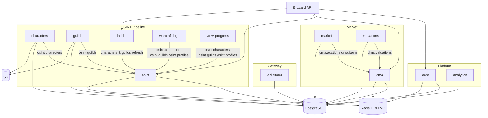

<div align="center">
  <a href="https://cmnw.me/" target="blank">
    
  </a>

  <h1>CMNW | Backend</h1>

  <p>NestJS microservices platform for World of Warcraft OSINT and market analytics — 13 services behind one REST gateway, scraping and enriching Blizzard data around the clock to power <a href="https://cmnw.me">cmnw.me</a> | <a href="https://cmnw.ru">cmnw.ru</a>.</p>
</div>

---

## 🏗️ Architecture


```mermaid
flowchart TB
  subgraph Gateway
    api[api :8080]
  end

  subgraph OSINT["OSINT Pipeline"]
    osint[osint]
    characters[characters]
    guilds[guilds]
    ladder[ladder]
    wl[warcraft-logs]
    wp[wow-progress]
  end

  subgraph Market
    dma[dma]
    market[market]
    valuations[valuations]
  end

  subgraph Platform
    core[core]
    analytics[analytics]
  end

  blizzard[Blizzard API] --> core
  blizzard --> osint
  blizzard --> dma
  blizzard --> ladder

  wl -->|osint.characters osint.guilds osint.profiles| osint
  wp -->|osint.characters osint.guilds osint.profiles| osint
  characters -->|osint.characters| osint
  guilds -->|osint.guilds| osint
  ladder -->|characters & guilds refresh| osint

  market -->|dma.auctions dma.items| dma
  valuations -->|dma.valuations| dma

  api --> pg[(PostgreSQL)]
  core --> pg
  osint --> pg
  characters --> pg
  guilds --> pg
  dma --> pg
  market --> pg
  valuations --> pg
  analytics --> pg

  core --> redis[(Redis + BullMQ)]
  osint --> redis
  dma --> redis
  characters --> s3[(S3)]
  guilds --> s3
```

Only `api` exposes HTTP (REST + Swagger + WebSocket live feed + Bull Board). Every other service is a headless worker booted via `createApplicationContext` — BullMQ processors and cron jobs, no inbound ports.

## ⚡ Tech Stack

<div align="center">

#### 🚀 Framework & Runtime

</div>
<div align="center">
<table align="center">
<tr align="center">
    <td valign="bottom"><br/>NestJS</td>
    <td valign="bottom"><br/>Node.js</td>
    <td valign="bottom"><br/>TypeScript</td>
    <td valign="bottom"><br/>SWC</td>
</tr>
</table>
</div>

<div align="center">

#### 💾 Data & Storage

</div>
<div align="center">
<table align="center">
<tr align="center">
    <td valign="bottom"><br/>PostgreSQL</td>
    <td valign="bottom"><br/>Redis</td>
    <td valign="bottom"><br/>MinIO · S3</td>
</tr>
</table>
</div>

<div align="center">

#### 🌐 External Data

</div>
<div align="center">
<table align="center">
<tr align="center">
    <td valign="bottom"><br/>Battle.net API</td>
</tr>
</table>
</div>

<div align="center">

#### 📊 Monitoring & Observability

</div>
<div align="center">
<table align="center">
<tr align="center">
    <td valign="bottom"><br/>Prometheus</td>
    <td valign="bottom"><br/>Grafana</td>
    <td valign="bottom"><br/>Loki</td>
</tr>
</table>
</div>

<div align="center">

#### 🔧 Tooling & CI/CD

</div>
<div align="center">
<table align="center">
<tr align="center">
    <td valign="bottom"><br/>Docker</td>
    <td valign="bottom"><br/>GitHub Actions</td>
    <td valign="bottom"><br/>pnpm</td>
    <td valign="bottom"><br/>Jest</td>
    <td valign="bottom"><br/>Biome</td>
    <td valign="bottom"><br/>OpenAPI / Swagger</td>
</tr>
</table>
</div>

Scraping for [Warcraft Logs](https://www.warcraftlogs.com) (HTML + GraphQL v2) and [WoWProgress](https://www.wowprogress.com) is done with Playwright stealth sessions.

## 🧱 Microservices

| Service | Type | Purpose |
|---------|------|---------|
| **api** | HTTP :8080 | REST gateway (`/api`), Swagger at `/api/docs`, Bull Board at `/queues`, WS live feed, battle-net & Discord OAuth |
| **core** | Worker | Battle.net key pool (refresh + rotation every 5 min), realm sync (daily / weekly) |
| **osint** | Worker ×5 | Character, guild, profile and hash-block ingestion — the reference worker app |
| **characters** | Worker | Re-indexes stale characters every 10 min (`updatedAt ASC`), optional S3 full-file indexing |
| **guilds** | Worker | Guild indexing — incremental every 10 min, full sweep weekly |
| **dma** | Worker ×2 | Auction house & item processors (`dma.auctions`, `dma.items`) |
| **market** | Worker | Scheduled ingest: auctions, commodities, contracts, gold, items, evaluation, XVA |
| **valuations** | Worker | One-shot rebuild of the `dma.valuations` queue from pricing/market data |
| **ladder** | Worker | PvP leaderboards & Mythic+ seasons (monthly / weekends) |
| **warcraft-logs** | Worker | Warcraft Logs scraping + GraphQL ingestion (hourly / daily) |
| **wow-progress** | Worker | WoWProgress ranks export & LFG scraping (every 5 min) |
| **analytics** | Worker | Daily 02:00 metric snapshots — character, guild, market, contracts, hall of fame, achievements |
| **tests** | Worker | Manual integration & benchmark harness |

## 📚 Shared Libraries

| Library | Purpose |
|---------|---------|
| `@app/resources` | DTOs, queues, constants, guards, transformers (`toGuid`, `toSlug`, `toGold`), utils |
| `@app/pg` | 29 TypeORM entities + enums, `SnakeNamingStrategy` |
| `@app/configuration` | Typed env config (postgres, redis, bullmq, battle.net, s3, loki) |
| `@app/logger` | Structured logging with Loki shipping, worker stats formatting |
| `@app/s3` | S3-compatible storage client (buckets `cmnw`, `cmnw-wow-progress`) |
| `@app/battle-net` | Blizzard API client with DB-backed key pool: per-key cooldown decay, 429 backoff, EU/US/KR/TW/CN regions |

## 📨 BullMQ Queues

| Queue | Concurrency | Producer → Consumer |
|-------|-------------|---------------------|
| `osint.characters` | 5 | characters / ladder / wl / wp → osint |
| `osint.guilds` | 5 | guilds / ladder / wl / wp → osint |
| `osint.profiles` | 5 | wl / wp → osint |
| `osint.hash` | 5 | osint → osint |
| `dma.auctions` | 10 | market → dma |
| `dma.items` | 10 | market → dma |
| `dma.valuations` | 10 | valuations → valuations |
| `core.realms` | 5 | core → core |

All queues: 3 attempts, exponential backoff, dead-letter retention of 500 failures, Bull Board dashboard at `/queues`.

## 🗃️ Database

29 PostgreSQL entities, no foreign keys by design — OSINT data arrives out-of-order from external APIs, so GUID references only (expected orphan rate ~7-8%, see [docs/FOREIGN_KEY_POLICY.md](docs/FOREIGN_KEY_POLICY.md)).

| Domain | Tables |
|--------|--------|
| Characters | `characters`, `characters_profile`, `characters_guilds_logs`, `characters_guild_members`, `characters_mounts`, `characters_pets`, `characters_professions`, `characters_raid_logs` |
| Guilds | `guilds`, `guilds_hall_of_fame` |
| Hash blocks | `hash_blocks`, `hash_block_logs`, `hash_block_members` |
| Game data | `items`, `mounts`, `pets`, `professions`, `skill_line`, `spell_effects`, `spell_reagents` |
| Market | `market`, `pricing`, `contracts`, `evaluations`, `valuations` |
| Platform | `realms`, `keys`, `users`, `analytics` |

**No FKs, ever** — GUID references only. GUID format: `{name-slug}@{realm-slug}`.

## 🐳 Compose Stacks

| Stack | Services |
|-------|----------|
| `docker-compose.db.yml` | PostgreSQL 17.4, Redis 7.4.3, BullMQ Redis (6380) |
| `docker-compose.core.yml` | core, api (:8080), analytics, cmnw-next frontend |
| `docker-compose.osint.yml` | osint ×5, characters, guilds, warcraft-logs, wow-progress |
| `docker-compose.dma.yml` | dma ×2, market |
| `docker-compose.analytics.yml` | Grafana (:3000), Prometheus (:9090), Loki (:3100), Promtail, Postgres exporter, 4 MCP servers |
| `docker-compose.dev.yml` | Minimal dev: PostgreSQL, Redis |

Images publish to `ghcr.io/alexzedim/{core,dma,osint}` on `v*` tag pushes via self-hosted GitHub Actions runners (x64 + arm64). Workers run with `--max-old-space-size=6144`.

## 🚀 Quick Start

```bash
git clone https://github.com/alexzedim/cmnw.git
cd cmnw
pnpm install
cp .env.docker .env          # fill in your values
docker compose -f docker-compose.db.yml up -d
pnpm build:all               # SWC, ~350ms
pnpm dev                     # watch mode — or `pnpm start` for the built API
```

| Script | Command |
|--------|---------|
| `pnpm build:all` | Build all apps + libs via SWC |
| `pnpm typecheck` | TypeScript 7 native (`tsc --noEmit`) |
| `pnpm lint` | Biome check + type-import audit |
| `pnpm test` | Jest (`--forceExit`) |
| `pnpm docker:build` | Build the local Docker image |

Swagger UI: `http://localhost:8080/api/docs` · Bull Board: `http://localhost:8080/queues`

## 📁 Project Structure

```
cmnw/
├── apps/
│   ├── api/                 # REST gateway, Swagger, WS feed, Bull Board, OAuth
│   ├── core/                # Realms, Battle.net key pool
│   ├── osint/               # Character/guild intelligence (reference worker)
│   ├── characters/          # Player profile processing
│   ├── guilds/              # Guild analytics processing
│   ├── dma/                 # Auction house monitoring
│   ├── market/              # Scheduled market ingest, XVA pricing
│   ├── valuations/          # Financial modeling
│   ├── analytics/           # Metric snapshots
│   ├── ladder/              # PvP & M+ leaderboards
│   ├── warcraft-logs/       # Warcraft Logs scraping + GraphQL
│   ├── wow-progress/        # WoWProgress scraping
│   └── tests/               # E2E harness
├── libs/
│   ├── resources/           # DTOs, queues, constants, utils, guards
│   ├── pg/                  # TypeORM entities & enums
│   ├── configuration/       # Env config modules
│   ├── logger/              # Structured logging (Loki)
│   ├── s3/                  # S3 storage integration
│   └── battle-net/          # Blizzard API client & key management
├── docker/                  # Dockerfiles (x64 / arm64 / local)
├── migrations/              # Hand-written SQL data migrations
├── docs/                    # Architecture & pattern documentation
└── icons/                   # README icon assets
```

## 📖 Documentation

Full documentation lives in [docs/](docs/README.md) — queue monitoring guides, migration reports, foreign-key policy, employee detection pattern, 429 strategy design, and historical decisions.

## 🌐 Ecosystem

| Project | Role |
|---------|------|
| **cmnw** | This backend — the data platform |
| [cmnw-next](https://github.com/alexzedim/cmnw-next) | Next.js frontend — [cmnw.me](https://cmnw.me) \| [cmnw.ru](https://cmnw.ru) |
| [cmnw-osint](https://github.com/alexzedim/cmnw-osint) | WoW addon — in-game data collection |
| [cmnw-oraculum](https://github.com/alexzedim/cmnw-oraculum) | Discord bot integration |
| [core](https://github.com/alexzedim/core) | Self-hosted infrastructure running it all |

---

**Maintained by:** [alexzedim](https://github.com/alexzedim) · MPL-2.0 · development conventions in [AGENTS.md](./AGENTS.md)
